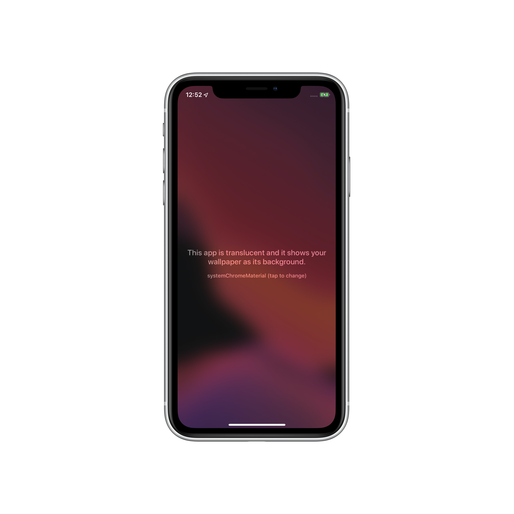

# Blurred background app

It used to require an entitlement for an iOS app to have a transparent background, showing through to the user's wallpaper. It looks like that's not the case anymore as of iOS 13. By setting the key `UIApplicationIsOpaque` to `NO` in your `Info.plist`, it's possible to have an app with a transparent background.

By using a visual effect view, it's possible to have an app with a blurred, vibrant background based on the user's wallpaper. That technique is demonstrated in this app.

**Disclaimer: this was tested on iOS 13 beta 1, it could be that Apple forgot to limit this to system apps and they can decide to remove this at any moment or reject apps using it, so use at your own risk.**

[Huge thanks to Tim Oliver for pointing this out](https://twitter.com/TimOliverAU/status/1139157909986611200).

